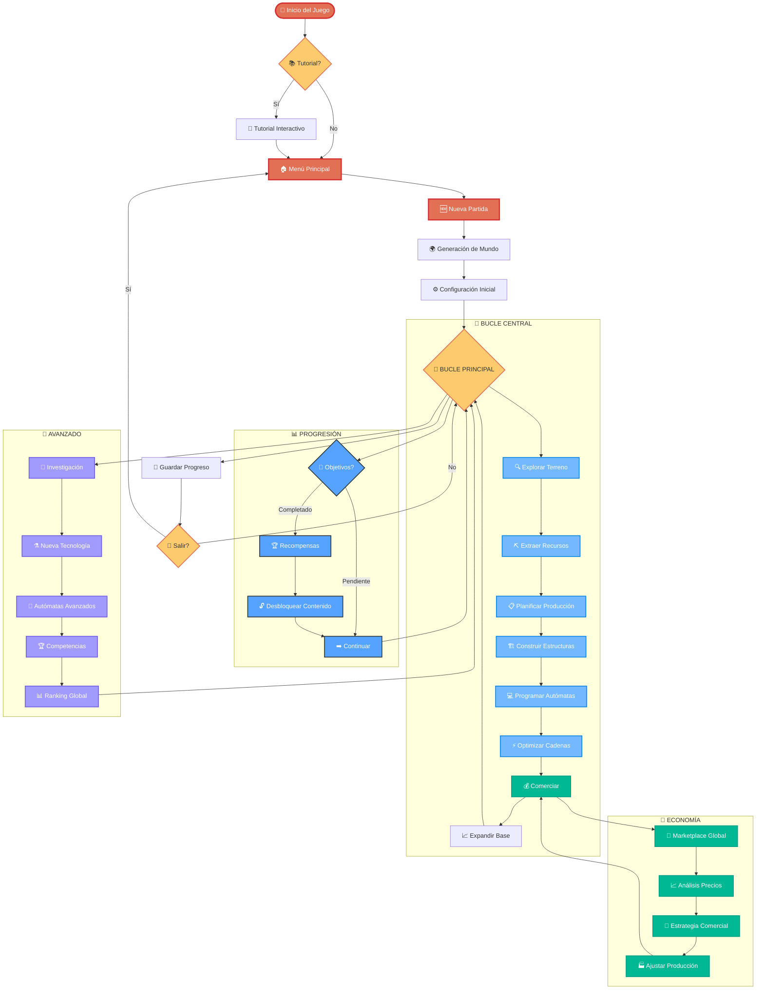
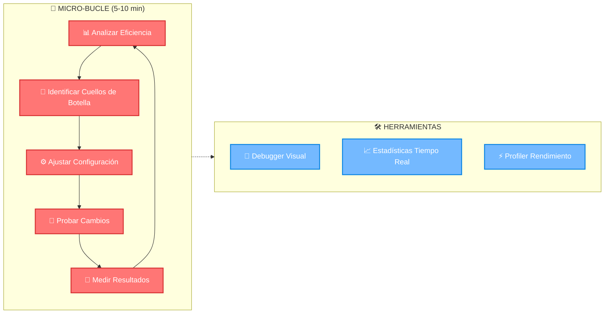

# 🎮 Mecánicas de Gameplay - Flujo de Juego Completo

## 🎯 Visión General del Gameplay

**Automata Factory Game** combina programación, gestión de recursos y estrategia económica en un loop de juego adictivo donde cada decisión impacta el crecimiento de tu imperio industrial.

---

## 🎮 Bucle Principal del Juego

### **🔄 Flujo de Juego Completo**



### **⚡ Micro-Bucle de Optimización**



### **🎯 Bucle Principal**

### **Loop Principal (5-10 minutos)**
```
1. Analizar Recursos → 2. Programar Autómatas → 3. Optimizar Producción → 4. Expandir Fábrica
                                    ↑                                                    ↓
                            5. Vender en Marketplace ← 4. Crear Autómatas Avanzados
```

### **Micro-Loop (30-60 segundos)**
```
Observar → Ajustar → Ejecutar → Evaluar
    ↑                              ↓
    ←──────── Iterar ←─────────────
```

---

## 🏗️ Mecánicas de Construcción y Expansión

### **Sistema de Terreno Hexagonal**
- **Expansión Gradual:** Compra de hexágonos adyacentes
- **Costo Escalado:** Cada expansión es más cara que la anterior
- **Recursos del Terreno:** Cada hexágono contiene depósitos específicos
- **Planificación Estratégica:** Layout óptimo para eficiencia

### **Colocación de Estructuras**
```
Tipos de Estructuras:
├── Extractores → Obtienen materiales del terreno
├── Máquinas → Transforman materiales
├── Almacenes → Guardan recursos
├── Transportadores → Mueven materiales
└── Centros de Control → Coordinan autómatas
```

### **Restricciones de Construcción**
- **Proximidad:** Estructuras deben estar conectadas
- **Recursos:** Costo en materiales para cada construcción
- **Espacio:** Límite de estructuras por hexágono
- **Energía:** Consumo energético balanceado

---

## 🤖 Programación de Autómatas

### **Editor de Pseudocódigo Visual**

#### **Comandos Básicos**
```pseudocode
MOVER(dirección)           // Norte, Sur, Este, Oeste, NE, NO, SE, SO
RECOGER(material)          // Toma material del suelo o estructura
DEPOSITAR(material)        // Deja material en estructura o suelo
ESPERAR(tiempo)           // Pausa por X segundos
REPETIR(veces) { ... }    // Loop con contador
MIENTRAS(condición) { ... } // Loop condicional
SI(condición) { ... }     // Condicional simple
```

#### **Comandos Avanzados**
```pseudocode
BUSCAR(material)          // Encuentra el material más cercano
OPTIMIZAR_RUTA()         // Calcula la ruta más eficiente
COMUNICAR(mensaje)       // Envía mensaje a otros autómatas
ANALIZAR_INVENTARIO()    // Revisa qué materiales tiene
REPORTAR_ESTADO()        // Informa su estado actual
```

### **Sistema de Variables**
```pseudocode
// Variables del sistema
MI_POSICION              // Coordenadas actuales
MI_INVENTARIO           // Lista de materiales que llevo
ENERGIA_RESTANTE        // Batería disponible
TAREA_ACTUAL           // Qué está haciendo ahora

// Variables personalizadas
contador = 0
material_objetivo = "Hierro"
destino = [5, 3]
```

### **Ejemplo de Programa Básico**
```pseudocode
// Autómata Recolector de Hierro
MIENTRAS(VERDADERO) {
    SI(MI_INVENTARIO.está_lleno()) {
        MOVER_A(almacén_hierro)
        DEPOSITAR(TODOS)
    } SINO {
        hierro_cercano = BUSCAR("Hierro")
        SI(hierro_cercano.existe()) {
            MOVER_A(hierro_cercano.posición)
            RECOGER("Hierro")
        } SINO {
            ESPERAR(5)
        }
    }
}
```

---

## ⚙️ Gestión de Recursos

### **Tipos de Recursos**

#### **Materiales Físicos**
- **Básicos:** Hierro, Cobre, Carbón, Silicio, Litio
- **Procesados:** Acero, Bronce, Cables, Chips, Baterías
- **Componentes:** Motores, Procesadores, Sensores, Actuadores
- **Productos:** Autómatas especializados

#### **Recursos de Sistema**
- **Energía:** Consumida por autómatas y máquinas
- **Espacio:** Limitado por terreno disponible
- **Tiempo:** Recurso más valioso para optimizar
- **Créditos:** Moneda del marketplace

### **Almacenamiento y Logística**
```
Sistema de Inventarios:
├── Inventario Personal (Autómatas) → 5-10 slots
├── Almacenes Pequeños → 50 slots por material
├── Almacenes Grandes → 200 slots por material
├── Silos Especializados → 500 slots, un material
└── Centro de Distribución → Gestión automática
```

### **Flujo de Materiales**
1. **Extracción** → Autómatas recolectan del terreno
2. **Transporte** → Movimiento a almacenes o máquinas
3. **Transformación** → Procesamiento en máquinas
4. **Almacenamiento** → Depósito en estructuras
5. **Distribución** → Envío a donde se necesita

---

## 🏭 Cadenas de Producción

### **Diseño de Líneas de Producción**

#### **Línea Básica (Acero)**
```
[Extractor Hierro] → [Autómata] → [Almacén Hierro]
                                        ↓
[Extractor Carbón] → [Autómata] → [Almacén Carbón]
                                        ↓
                                  [Horno Básico] → [Almacén Acero]
```

#### **Línea Compleja (Autómata de Transporte)**
```
Múltiples Líneas Paralelas:
├── Línea A: Hierro + Carbón → Acero
├── Línea B: Cobre → Cables
├── Línea C: Silicio + Cobre → Chips
├── Línea D: Acero + Cables + Chips → Motor
└── Ensamblaje Final → Autómata Completo
```

### **Optimización de Eficiencia**
- **Balanceado de Líneas:** Sincronizar velocidades de producción
- **Minimizar Transporte:** Reducir distancias de movimiento
- **Paralelización:** Múltiples autómatas en tareas similares
- **Buffer Management:** Almacenes intermedios para suavizar flujo

---

## 💰 Sistema Económico

### **Marketplace Global**

#### **Mecánicas de Compra/Venta**
- **Listado de Productos:** Subir autómatas con precio y descripción
- **Búsqueda y Filtros:** Encontrar productos específicos
- **Sistema de Ofertas:** Negociación de precios
- **Calificaciones:** Reputación de vendedores y productos

#### **Factores de Precio**
```
Precio Base × Multiplicadores:
├── Rareza de Materiales (1.0x - 3.0x)
├── Complejidad de Fabricación (1.0x - 2.5x)
├── Eficiencia del Código (0.8x - 1.5x)
├── Demanda del Mercado (0.5x - 2.0x)
└── Reputación del Vendedor (0.9x - 1.3x)
```

### **Estrategias Económicas**

#### **Especialización**
- **Ventaja:** Dominio completo de un nicho
- **Riesgo:** Dependencia de un solo mercado
- **Ejemplo:** Ser el mejor en autómatas de energía

#### **Diversificación**
- **Ventaja:** Múltiples fuentes de ingresos
- **Riesgo:** Competencia en varios frentes
- **Ejemplo:** Producir varios tipos de autómatas

#### **Integración Vertical**
- **Ventaja:** Control total de la cadena de suministro
- **Riesgo:** Alta inversión inicial
- **Ejemplo:** Desde extracción hasta producto final

---

## 🎯 Objetivos y Progresión

### **Sistema de Logros**

#### **Logros de Producción**
- **Primer Autómata:** Crear tu primer autómata funcional
- **Línea de Ensamblaje:** Producir 10 autómatas del mismo tipo
- **Maestro de la Eficiencia:** Optimizar una línea a >95% eficiencia
- **Magnate Industrial:** Producir 100 autómatas en total

#### **Logros de Programación**
- **Primer Programa:** Escribir tu primer código funcional
- **Optimizador:** Reducir un programa en 50% de líneas
- **Innovador:** Crear un algoritmo único y eficiente
- **Maestro Programador:** Tener 10 programas diferentes funcionando

#### **Logros Económicos**
- **Primera Venta:** Vender tu primer autómata
- **Empresario:** Generar 1,000 créditos en ventas
- **Monopolista:** Dominar 80% del mercado en una categoría
- **Millonario:** Acumular 1,000,000 créditos

### **Ranking Global**
```
Categorías de Ranking:
├── Producción Total → Autómatas creados
├── Eficiencia → Recursos por autómata
├── Innovación → Algoritmos únicos
├── Ventas → Créditos generados
└── Reputación → Calificaciones promedio
```

---

## 🔧 Mecánicas de Optimización

### **Debugging de Autómatas**
- **Modo Paso a Paso:** Ejecutar código línea por línea
- **Breakpoints:** Pausar en puntos específicos
- **Variables Watch:** Monitorear valores en tiempo real
- **Log de Actividades:** Historial de acciones del autómata

### **Análisis de Performance**
```
Métricas Clave:
├── Tiempo por Tarea → Eficiencia temporal
├── Distancia Recorrida → Optimización de rutas
├── Uso de Energía → Eficiencia energética
├── Idle Time → Tiempo sin hacer nada
└── Throughput → Materiales procesados por hora
```

### **Herramientas de Optimización**
- **Heatmaps:** Visualizar patrones de movimiento
- **Gráficos de Flujo:** Analizar cuellos de botella
- **Simulador:** Probar cambios sin implementar
- **Comparador:** Evaluar diferentes algoritmos

---

## 🎮 Experiencia de Usuario

### **Curva de Aprendizaje**
```
Fase 1: Tutorial (30 min)
├── Conceptos básicos
├── Primer autómata
└── Primera venta

Fase 2: Experimentación (2-3 horas)
├── Diferentes tipos de autómatas
├── Optimización básica
└── Comprensión del mercado

Fase 3: Maestría (10+ horas)
├── Estrategias avanzadas
├── Dominación del mercado
└── Innovación constante
```

### **Feedback y Recompensas**
- **Feedback Inmediato:** Resultados visibles de cada acción
- **Progreso Visible:** Barras de progreso y estadísticas
- **Celebración de Logros:** Animaciones y efectos especiales
- **Comparación Social:** Rankings y competencias

---

## 🚀 Mecánicas Avanzadas (Late Game)

### **Investigación y Desarrollo**
- **Nuevos Materiales:** Descubrir aleaciones avanzadas
- **Algoritmos IA:** Autómatas que aprenden y se adaptan
- **Tecnologías Disruptivas:** Cambiar las reglas del juego
- **Colaboración:** Proyectos conjuntos entre jugadores

### **Competencias y Eventos**
- **Desafíos Semanales:** Objetivos específicos con recompensas
- **Torneos de Eficiencia:** Competir por la mejor optimización
- **Eventos Estacionales:** Contenido temporal especial
- **Colaboraciones Globales:** Proyectos que requieren toda la comunidad

---

**Relacionado:** [🏭 Materiales y Transformación](materials-tree.md) | [💰 Costos de Infraestructura](costs.md) | **Volver a:** [🏠 README Principal](../../README.md) 