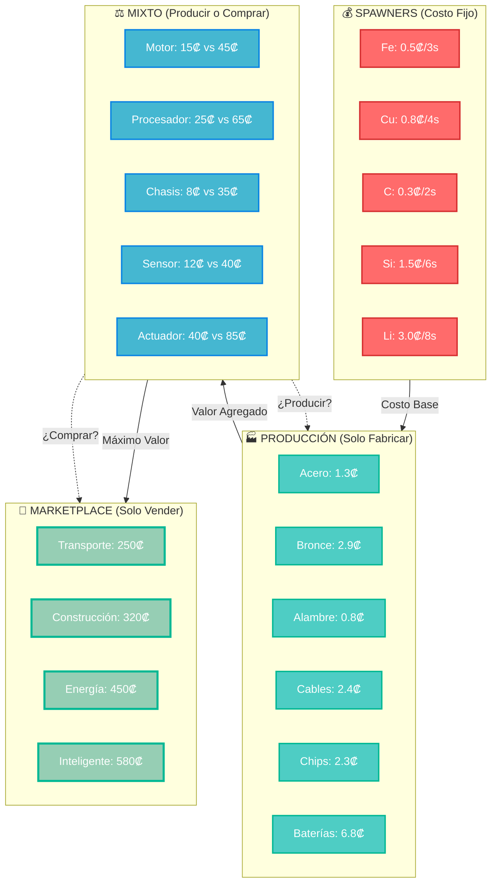

# 🏭 Materiales y Transformación - Sistema de Spawners y Producción

## 🎯 Visión General del Sistema

El sistema de materiales combina **spawners económicos** para materiales básicos con **producción industrial** para componentes avanzados. Los jugadores deben balancear costos de extracción, eficiencia de producción y estrategias de marketplace.

---

## 💰 Sistema de Spawners (Solo Materiales Básicos)

### **🏭 Mecánica de Spawners**

Los spawners son la **única fuente** de materiales básicos y operan bajo las siguientes reglas:

#### **⏱️ Sistema de Ticks**
- Cada spawner genera **1 unidad por tick** si está libre
- Si el spawner está **ocupado** (material sin recoger), no genera nuevo material
- **Costo por unidad** se deduce automáticamente del balance del jugador
- Sin dinero = spawner se detiene hasta tener fondos

#### **💸 Costos de Extracción por Material**

| Material | Símbolo | Costo/Unidad | Tick Rate | Abundancia |
|----------|---------|--------------|-----------|------------|
| **Hierro** | Fe 🔴 | 0.5₡ | 3 seg | Alta |
| **Cobre** | Cu 🟠 | 0.8₡ | 4 seg | Media |
| **Carbón** | C ⚫ | 0.3₡ | 2 seg | Alta |
| **Silicio** | Si 🔵 | 1.5₡ | 6 seg | Media |
| **Litio** | Li 🟡 | 3.0₡ | 8 seg | Baja |

#### **🎯 Estrategia de Spawners**
```
Gestión Eficiente:
├── 🔄 Recoger materiales rápidamente para mantener spawners activos
├── 💰 Balancear costos de extracción vs. ingresos por ventas
├── 📦 Optimizar almacenamiento para evitar bloqueos
└── ⚡ Priorizar materiales según demanda del marketplace
```

---

## 🏭 Sistema de Producción (Todo lo Demás)

### **⚙️ Materiales Procesados (Tier 2) - Solo Producción**

Estos materiales **NO se pueden comprar** en el marketplace, solo producir:

| Material | Componentes | Máquina | Tiempo | Costo Producción |
|----------|-------------|---------|--------|------------------|
| **Acero** | 2 Fe + 1 C | Fundición | 30s | 1.3₡ materiales |
| **Bronce** | 3 Cu + 1 Fe | Fundición | 25s | 2.9₡ materiales |
| **Alambre de Cobre** | 1 Cu | Extrusora | 8s | 0.8₡ materiales |
| **Cables** | 3 Alambre + Aislante | Ensamblador | 12s | 2.4₡ + Aislante |
| **Chips** | 1 Si + 1 Alambre | Fab. Electrónica | 25s | 2.3₡ materiales |
| **Baterías** | 2 Li + 1 Alambre | Ensamblador | 20s | 6.8₡ materiales |

### **🔧 Componentes Avanzados (Tier 3) - Producción + Marketplace**

Estos se pueden **producir** O **comprar** en el marketplace:

| Componente | Costo Producción | Precio Marketplace | Diferencia |
|------------|------------------|-------------------|------------|
| **Motor** | ~15₡ materiales | 45₡ | +200% |
| **Procesador** | ~25₡ materiales | 65₡ | +160% |
| **Chasis** | ~8₡ materiales | 35₡ | +337% |
| **Sensor** | ~12₡ materiales | 40₡ | +233% |
| **Actuador** | ~40₡ materiales | 85₡ | +112% |

### **🤖 Autómatas (Tier 4) - Solo Marketplace**

Los autómatas completos **solo se venden** en el marketplace:

| Autómata | Costo Total Producción | Precio Venta | Margen |
|----------|------------------------|--------------|--------|
| **Transporte** | ~80₡ | 250₡ | +212% |
| **Construcción** | ~140₡ | 320₡ | +128% |
| **Energía** | ~180₡ | 450₡ | +150% |
| **Inteligente** | ~220₡ | 580₡ | +163% |

---

## 🏪 Estrategias de Marketplace vs Producción

### **📊 Análisis Económico**



### **🎯 Decisiones Estratégicas**

#### **Early Game: Optimizar Spawners**
```
Prioridades:
├── 🔄 Mantener spawners de Hierro y Carbón activos (bajo costo)
├── 💰 Minimizar costos de Litio hasta tener ingresos estables
├── 📦 Construir almacenamiento para evitar bloqueos
└── ⚡ Foco en Acero para infraestructura básica
```

#### **Mid Game: Producir vs Comprar**
```
Análisis por Componente:
├── ✅ PRODUCIR: Chasis (337% markup) - Máxima rentabilidad
├── ✅ PRODUCIR: Sensores (233% markup) - Alta rentabilidad
├── ⚖️ EVALUAR: Motores (200% markup) - Según capacidad
├── ⚖️ EVALUAR: Procesadores (160% markup) - Según demanda
└── ❌ COMPRAR: Actuadores (112% markup) - Si falta tiempo
```

#### **Late Game: Maximizar Márgenes**
```
Estrategia de Autómatas:
├── 🎯 Especialización en 1-2 tipos de autómatas
├── 🏭 Líneas de producción completamente automatizadas
├── 📈 Optimización de costos de spawners (eficiencia energética)
└── 🏪 Dominación de nicho específico en marketplace
```

---

## ⚡ Optimización de Costos de Spawners

### **💡 Eficiencia por Material**

| Material | Costo/Min | Valor Agregado Potencial | ROI |
|----------|-----------|-------------------------|-----|
| **Hierro** | 10₡/min | Acero (5₡) → Motor (45₡) | 450% |
| **Cobre** | 12₡/min | Alambre (2₡) → Cables (3₡) → Motor | 375% |
| **Carbón** | 9₡/min | Acero (5₡) → Componentes | 500% |
| **Silicio** | 15₡/min | Chips (12₡) → Procesador (65₡) | 433% |
| **Litio** | 22.5₡/min | Baterías (15₡) → Procesador | 289% |

### **🔄 Gestión de Flujo de Caja**

#### **Ciclo Económico Básico**
```
1. 💰 Inversión Inicial: Activar spawners básicos (Fe, C)
2. 🏭 Producción: Acero → Chasis → Venta rápida
3. 📈 Reinversión: Expandir a Cobre y Silicio
4. 🎯 Especialización: Foco en autómatas rentables
5. 🏪 Dominación: Control de mercado específico
```

#### **Indicadores Clave**
- **Break-even Point:** Tiempo hasta recuperar inversión en spawners
- **Cash Flow:** Balance entre costos de spawners e ingresos
- **Efficiency Ratio:** Valor producido vs. costo de materiales básicos
- **Market Share:** Porcentaje de ventas en categoría especializada

---

## ⚙️ Mecánica Detallada de Spawners

### **🔄 Sistema de Ticks y Estados**

#### **Estados del Spawner**
```
🟢 ACTIVO: Spawner libre, genera material cada tick
├── ✅ Condiciones: Espacio libre + dinero suficiente
├── ⏱️ Acción: Genera 1 unidad y deduce costo
└── 🔄 Siguiente: Estado OCUPADO

🔴 OCUPADO: Material sin recoger, no genera nuevo
├── ❌ Condiciones: Material presente en spawner
├── ⏸️ Acción: Espera hasta que se recoja material
└── 🔄 Siguiente: Estado ACTIVO (si se recoge)

🟡 SIN FONDOS: Dinero insuficiente para generar
├── 💰 Condiciones: Balance < costo del material
├── ⏸️ Acción: Spawner pausado hasta tener dinero
└── 🔄 Siguiente: Estado ACTIVO (si hay fondos)
```

#### **⏱️ Timing de Spawners**

| Material | Tick Rate | Costo/Tick | Costo/Minuto | Unidades/Minuto |
|----------|-----------|-------------|---------------|-----------------|
| **Hierro** | 3 seg | 0.5₡ | 10₡ | 20 unidades |
| **Cobre** | 4 seg | 0.8₡ | 12₡ | 15 unidades |
| **Carbón** | 2 seg | 0.3₡ | 9₡ | 30 unidades |
| **Silicio** | 6 seg | 1.5₡ | 15₡ | 10 unidades |
| **Litio** | 8 seg | 3.0₡ | 22.5₡ | 7.5 unidades |

### **📦 Gestión de Inventario y Spawners**

#### **Estrategias de Recolección**
```
🤖 Automatización Recomendada:
├── 🔄 Autómata de Transporte: Recolección automática cada 2-3 segundos
├── 📦 Almacén Cercano: Máximo 2 tiles de distancia
├── ⚡ Prioridad: Materiales más costosos primero (Li > Si > Cu > Fe > C)
└── 🎯 Backup Manual: Para emergencias o inicio de partida

📊 Indicadores de Eficiencia:
├── ⏱️ Tiempo Spawner Ocupado: <10% del tiempo total
├── 💰 Costo vs Ingresos: Ratio positivo constante
├── 📈 Throughput: Unidades/hora vs. capacidad máxima
└── 🔋 Energía: Costo energético de recolección vs. valor
```

#### **🎯 Optimización por Fase de Juego**

##### **Fase 1: Arranque (0-15 min)**
```
Spawners Activos:
├── ✅ Hierro: Esencial para infraestructura
├── ✅ Carbón: Necesario para Acero
├── ❌ Cobre: Solo si hay demanda inmediata
├── ❌ Silicio: Demasiado costoso inicialmente
└── ❌ Litio: Prohibitivo en early game

Estrategia: Minimizar costos, maximizar Acero
```

##### **Fase 2: Expansión (15-45 min)**
```
Spawners Activos:
├── ✅ Hierro + Carbón: Mantener para Acero
├── ✅ Cobre: Activar para Alambre y Cables
├── ⚖️ Silicio: Solo si hay pedidos de Chips
├── ❌ Litio: Esperar hasta tener ingresos estables
└── 🎯 Foco: Diversificar hacia componentes Tier 2

Estrategia: Balancear costos con diversificación
```

##### **Fase 3: Especialización (45+ min)**
```
Spawners Activos:
├── ✅ Todos los materiales según especialización
├── 🎯 Hierro/Carbón: Si especialización en Motores/Chasis
├── 🎯 Cobre/Silicio: Si especialización en Electrónicos
├── 🎯 Litio: Si especialización en Energía
└── 📈 Optimización: Según demanda del marketplace

Estrategia: Maximizar ROI de especialización elegida
```

### **💡 Tips Avanzados de Spawners**

#### **🔧 Micro-gestión Eficiente**
```
Técnicas Profesionales:
├── 🕐 Timing Perfecto: Recoger justo antes del siguiente tick
├── 📊 Análisis de Demanda: Activar spawners según órdenes pendientes
├── 💰 Cash Flow Management: Pausar spawners caros en momentos críticos
├── 🎯 Priorización Dinámica: Cambiar foco según precios de marketplace
└── ⚡ Eficiencia Energética: Minimizar distancias de transporte
```

#### **📈 Métricas de Rendimiento**
```
KPIs de Spawners:
├── 📊 Uptime: % tiempo que spawner está generando (objetivo: >90%)
├── 💰 Cost Efficiency: Costo/unidad vs. valor final del producto
├── ⏱️ Collection Speed: Tiempo promedio entre generación y recolección
├── 🎯 ROI per Material: Retorno de inversión por tipo de material
└── 📈 Throughput Optimization: Unidades/hora vs. capacidad teórica máxima
```

---

## 🧱 Materiales Básicos (Tier 1) - Solo Spawners

### **Recursos Primarios** - Únicamente de spawners con costo

| Material | Símbolo | Costo | Tick Rate | Uso Principal | Estrategia |
|----------|---------|-------|-----------|---------------|------------|
| **Hierro** | Fe 🔴 | 0.5₡ | 3 seg | Estructura base | Mantener activo siempre |
| **Cobre** | Cu 🟠 | 0.8₡ | 4 seg | Conductividad | Según demanda de cables |
| **Carbón** | C ⚫ | 0.3₡ | 2 seg | Aleaciones | Activar para acero |
| **Silicio** | Si 🔵 | 1.5₡ | 6 seg | Electrónicos | Solo para chips/sensores |
| **Litio** | Li 🟡 | 3.0₡ | 8 seg | Baterías | Minimizar hasta late game |

### **💰 Cálculo de Costos por Hora**

```
Spawner Activo 1 Hora:
├── Hierro: 0.5₡ × 1200 ticks = 600₡/hora
├── Cobre: 0.8₡ × 900 ticks = 720₡/hora
├── Carbón: 0.3₡ × 1800 ticks = 540₡/hora
├── Silicio: 1.5₡ × 600 ticks = 900₡/hora
└── Litio: 3.0₡ × 450 ticks = 1350₡/hora

Total 5 Spawners: 4110₡/hora
```

### **🎯 Recomendaciones de Activación**

#### **Fase Inicial (0-30 min)**
- ✅ Hierro + Carbón: Producir Acero básico
- ❌ Otros materiales: Demasiado costosos

#### **Fase Expansión (30-60 min)**
- ✅ + Cobre: Alambre y cables
- ⚖️ Silicio: Solo si hay demanda de chips

#### **Fase Avanzada (60+ min)**
- ✅ + Litio: Para baterías y autómatas energéticos
- 🎯 Optimización completa según especialización

---

**Relacionado:** [🎮 Mecánicas de Gameplay](gameplay.md) | [💰 Costos de Infraestructura](costs.md) | **Volver a:** [🏠 README Principal](../../README.md)