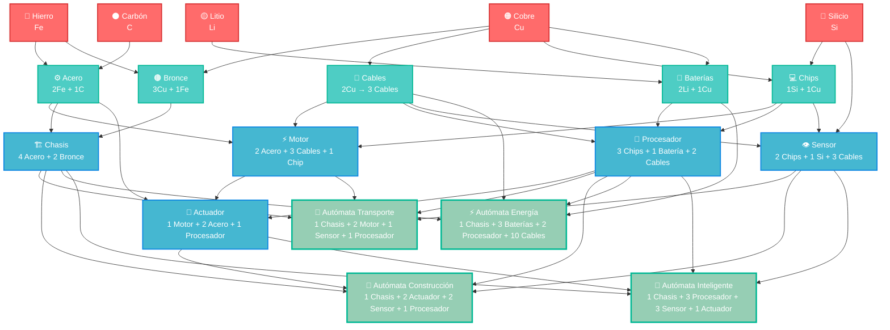

# 🏭 Materiales y Transformación - Árbol Completo de Producción

## 🎯 Visión General del Sistema

El sistema de materiales y transformación es el **corazón económico** del juego, donde los jugadores crean cadenas de producción cada vez más complejas para fabricar autómatas avanzados y competir en el marketplace global.

---

## 🌳 Árbol de Transformación Completo



### **📊 Leyenda del Diagrama**
- 🔴 **Tier 1 (Rojo):** Materiales básicos extraídos del terreno
- 🔵 **Tier 2 (Azul Claro):** Materiales procesados (primera transformación)
- 🟦 **Tier 3 (Azul):** Componentes avanzados (segunda transformación)
- 🟢 **Tier 4 (Verde):** Autómatas completos (producto final)

---

## 🏭 Flujo de Producción con Máquinas

```mermaid
flowchart LR
    %% Extracción
    subgraph Extraccion["🏔️ EXTRACCIÓN"]
        Mina[⛏️ Mina<br/>5 seg/unidad]
        Pozo[🕳️ Pozo Petróleo<br/>3 seg/unidad]
    end
    
    %% Procesamiento Básico
    subgraph ProcBasico["🔥 PROCESAMIENTO BÁSICO"]
        Fundicion[🔥 Fundición<br/>10 seg]
        Refineria[⚗️ Refinería<br/>15 seg]
        Ensamblador1[🔧 Ensamblador I<br/>8 seg]
    end
    
    %% Procesamiento Avanzado
    subgraph ProcAvanzado["⚙️ PROCESAMIENTO AVANZADO"]
        Ensamblador2[🔧 Ensamblador II<br/>20 seg]
        FabricaChips[💻 Fábrica Chips<br/>25 seg]
        TallerMotores[⚡ Taller Motores<br/>30 seg]
    end
    
    %% Ensamblaje Final
    subgraph EnsamblajeFinal["🏭 ENSAMBLAJE FINAL"]
        LineaAutomatas[🤖 Línea Autómatas<br/>60-120 seg]
    end
    
    %% Flujo de materiales
    Mina --> |Fe, Cu, Si, Li| Fundicion
    Pozo --> |C| Refineria
    
    Fundicion --> |Acero, Bronce| Ensamblador2
    Refineria --> |Cables| Ensamblador1
    Ensamblador1 --> |Chips, Baterías| FabricaChips
    
    Ensamblador2 --> |Chasis| LineaAutomatas
    FabricaChips --> |Procesador, Sensor| TallerMotores
    TallerMotores --> |Motor, Actuador| LineaAutomatas
    
    LineaAutomatas --> |Autómatas| Marketplace[🏪 Marketplace]
    
    %% Estilos
    classDef extraccion fill:#8b5a3c,stroke:#6d4c41,stroke-width:2px,color:#fff
    classDef basico fill:#ff7675,stroke:#d63031,stroke-width:2px,color:#fff
    classDef avanzado fill:#74b9ff,stroke:#0984e3,stroke-width:2px,color:#fff
    classDef final fill:#55a3ff,stroke:#2d3436,stroke-width:3px,color:#fff
    classDef market fill:#00b894,stroke:#00a085,stroke-width:3px,color:#fff
    
    class Mina,Pozo extraccion
    class Fundicion,Refineria,Ensamblador1 basico
    class Ensamblador2,FabricaChips,TallerMotores avanzado
    class LineaAutomatas final
    class Marketplace market
```



### **⏱️ Tiempos de Producción por Máquina**
| Máquina | Tiempo Base | Eficiencia | Costo Energía |
|---------|-------------|------------|---------------|
| ⛏️ Mina | 5 seg/unidad | 100% | 2 kW |
| 🔥 Fundición | 10 seg | 95% | 5 kW |
| 🔧 Ensamblador I | 8 seg | 90% | 3 kW |
| 🔧 Ensamblador II | 20 seg | 85% | 8 kW |
| 💻 Fábrica Chips | 25 seg | 80% | 12 kW |
| ⚡ Taller Motores | 30 seg | 75% | 15 kW |
| 🤖 Línea Autómatas | 60-120 seg | 70% | 25 kW |

---

## 🧱 Materiales Básicos (Tier 1)

### **Recursos Primarios** - Extraídos del terreno

| Material | Símbolo | Color | Abundancia | Uso Principal |
|----------|---------|-------|------------|---------------|
| **Hierro** | Fe | 🔴 Rojo | Alta | Estructura y componentes básicos |
| **Cobre** | Cu | 🟠 Naranja | Media | Circuitos y conductividad |
| **Carbón** | C | ⚫ Negro | Alta | Energía y aleaciones |
| **Silicio** | Si | 🔵 Azul | Media | Electrónicos y procesadores |
| **Litio** | Li | 🟡 Amarillo | Baja | Baterías y almacenamiento |

### Características de Extracción:
- **Hierro y Carbón:** Abundantes, fáciles de extraer
- **Cobre y Silicio:** Moderadamente raros, requieren exploración
- **Litio:** Escaso, encontrado en depósitos especiales

---

## ⚙️ Materiales Procesados (Tier 2)

### **Aleaciones y Compuestos** - Primera transformación

| Material | Componentes | Máquina | Tiempo | Valor |
|----------|-------------|---------|--------|-------|
| **Acero** | 2 Hierro + 1 Carbón | Horno Básico | 30s | 3x |
| **Bronce** | 3 Cobre + 1 Hierro | Horno Básico | 25s | 2.5x |
| **Cables** | 2 Cobre | Extrusora | 15s | 2x |
| **Chips** | 1 Silicio + 1 Cobre | Fab. Electrónica | 45s | 4x |
| **Baterías** | 2 Litio + 1 Cobre | Ensambladora | 60s | 5x |

### **Fórmulas de Transformación:**
```
Acero = 2Fe + 1C → 1 Acero (Valor: 3 unidades básicas)
Bronce = 3Cu + 1Fe → 1 Bronce (Valor: 2.5 unidades básicas)
Cables = 2Cu → 3 Cables (Valor: 2 unidades básicas)
Chips = 1Si + 1Cu → 1 Chip (Valor: 4 unidades básicas)
Baterías = 2Li + 1Cu → 1 Batería (Valor: 5 unidades básicas)
```

---

## 🔧 Componentes Avanzados (Tier 3)

### **Partes Especializadas** - Segunda transformación

| Componente | Materiales Requeridos | Máquina | Tiempo | Complejidad |
|------------|----------------------|---------|--------|-------------|
| **Motor** | 2 Acero + 3 Cables + 1 Chip | Ensambladora Avanzada | 120s | Media |
| **Procesador** | 3 Chips + 1 Batería + 2 Cables | Fab. Avanzada | 180s | Alta |
| **Chasis** | 4 Acero + 2 Bronce | Soldadora | 90s | Baja |
| **Sensor** | 2 Chips + 1 Silicio + 3 Cables | Fab. Electrónica | 150s | Media |
| **Actuador** | 1 Motor + 2 Acero + 1 Procesador | Ensambladora Avanzada | 200s | Alta |

### **Cadenas de Dependencia:**
```
Motor:
├── Acero (2) ← Hierro (4) + Carbón (2)
├── Cables (3) ← Cobre (6)
└── Chip (1) ← Silicio (1) + Cobre (1)

Procesador:
├── Chips (3) ← Silicio (3) + Cobre (3)
├── Batería (1) ← Litio (2) + Cobre (1)
└── Cables (2) ← Cobre (4)
```

---

## 🤖 Autómatas (Tier 4)

### **Tipos de Autómatas por Especialización**

#### **🚚 Autómata de Transporte**
**Función:** Movimiento eficiente de materiales
```
Componentes Requeridos:
├── Chasis (1) → 4 Acero + 2 Bronce
├── Motor (2) → 4 Acero + 6 Cables + 2 Chips
├── Sensor (1) → 2 Chips + 1 Silicio + 3 Cables
└── Procesador (1) → 3 Chips + 1 Batería + 2 Cables

Tiempo Total de Fabricación: ~15 minutos
Valor de Mercado: 50-80 créditos
```

#### **🔨 Autómata de Construcción**
**Función:** Construcción y reparación de estructuras
```
Componentes Requeridos:
├── Chasis (1) → 4 Acero + 2 Bronce
├── Actuador (2) → 2 Motores + 4 Acero + 2 Procesadores
├── Sensor (2) → 4 Chips + 2 Silicio + 6 Cables
└── Procesador (1) → 3 Chips + 1 Batería + 2 Cables

Tiempo Total de Fabricación: ~25 minutos
Valor de Mercado: 120-180 créditos
```

#### **⚡ Autómata de Energía**
**Función:** Gestión y distribución de energía
```
Componentes Requeridos:
├── Chasis (1) → 4 Acero + 2 Bronce
├── Baterías (3) → 6 Litio + 3 Cobre
├── Procesador (2) → 6 Chips + 2 Baterías + 4 Cables
└── Cables (10) → 20 Cobre

Tiempo Total de Fabricación: ~20 minutos
Valor de Mercado: 200-300 créditos
```

#### **🧠 Autómata Inteligente**
**Función:** Coordinación y optimización de procesos
```
Componentes Requeridos:
├── Chasis (1) → 4 Acero + 2 Bronce
├── Procesador (3) → 9 Chips + 3 Baterías + 6 Cables
├── Sensor (3) → 6 Chips + 3 Silicio + 9 Cables
└── Actuador (1) → 1 Motor + 2 Acero + 1 Procesador

Tiempo Total de Fabricación: ~35 minutos
Valor de Mercado: 400-600 créditos
```

---

## 🏭 Máquinas de Transformación

### **Máquinas Básicas (Fase 4)**

#### **🔥 Horno Básico**
- **Función:** Fusión de metales básicos
- **Procesa:** Hierro + Carbón → Acero, Cobre + Hierro → Bronce
- **Velocidad:** 1 unidad cada 30 segundos
- **Costo:** 10 Hierro + 5 Carbón

#### **🔌 Extrusora**
- **Función:** Formado de cables y componentes simples
- **Procesa:** Cobre → Cables
- **Velocidad:** 3 unidades cada 15 segundos
- **Costo:** 8 Hierro + 5 Cobre

#### **💻 Fábrica Electrónica**
- **Función:** Creación de componentes electrónicos
- **Procesa:** Silicio + Cobre → Chips, Chips + Componentes → Sensores
- **Velocidad:** 1 unidad cada 45 segundos
- **Costo:** 15 Hierro + 10 Cobre + 5 Silicio

### **Máquinas Avanzadas (Fase 5-6)**

#### **🏗️ Ensambladora Avanzada**
- **Función:** Ensamblaje de componentes complejos
- **Procesa:** Motores, Actuadores, Autómatas completos
- **Velocidad:** 1 unidad cada 2-5 minutos
- **Costo:** 25 Acero + 15 Chips + 10 Cables

#### **⚙️ Soldadora**
- **Función:** Unión de estructuras metálicas
- **Procesa:** Chasis y estructuras grandes
- **Velocidad:** 1 unidad cada 90 segundos
- **Costo:** 20 Acero + 10 Bronce + 5 Cables

---

## 💰 Economía y Balanceado

### **📈 Progresión de Valor**

```mermaid
graph LR
    subgraph Valores["💰 VALORES DE MERCADO"]
        subgraph T1["Tier 1 - Básicos"]
            Fe1[Fe: 1₡]
            Cu1[Cu: 1₡]
            C1[C: 1₡]
            Si1[Si: 2₡]
            Li1[Li: 3₡]
        end
        
        subgraph T2["Tier 2 - Procesados"]
            Acero2[Acero: 5₡]
            Bronce2[Bronce: 8₡]
            Cables2[Cables: 3₡]
            Chips2[Chips: 12₡]
            Baterias2[Baterías: 15₡]
        end
        
        subgraph T3["Tier 3 - Componentes"]
            Motor3[Motor: 45₡]
            Procesador3[Procesador: 65₡]
            Chasis3[Chasis: 35₡]
            Sensor3[Sensor: 40₡]
            Actuador3[Actuador: 85₡]
        end
        
        subgraph T4["Tier 4 - Autómatas"]
            AutoT4[Transporte: 250₡]
            AutoC4[Construcción: 320₡]
            AutoE4[Energía: 450₡]
            AutoI4[Inteligente: 580₡]
        end
    end
    
    %% Flujo de valor
    T1 --> T2
    T2 --> T3
    T3 --> T4
    
    %% Multiplicadores de valor
    T1 -.->|x5-15| T2
    T2 -.->|x3-8| T3
    T3 -.->|x3-7| T4
    
    %% Estilos
    classDef tier1 fill:#ff6b6b,stroke:#d63031,stroke-width:2px,color:#fff
    classDef tier2 fill:#4ecdc4,stroke:#00b894,stroke-width:2px,color:#fff
    classDef tier3 fill:#45b7d1,stroke:#0984e3,stroke-width:2px,color:#fff
    classDef tier4 fill:#96ceb4,stroke:#00b894,stroke-width:3px,color:#fff
    
    class Fe1,Cu1,C1,Si1,Li1 tier1
    class Acero2,Bronce2,Cables2,Chips2,Baterias2 tier2
    class Motor3,Procesador3,Chasis3,Sensor3,Actuador3 tier3
    class AutoT4,AutoC4,AutoE4,AutoI4 tier4
```



### **📊 Análisis Tiempo vs Valor**

| Material/Componente | Tiempo Total | Valor Final | Eficiencia (₡/min) |
|---------------------|--------------|-------------|-------------------|
| 🔴 **Materiales Básicos** | 5 seg | 1-3₡ | 12-36₡/min |
| 🔵 **Materiales Procesados** | 15-25 seg | 5-15₡ | 12-36₡/min |
| 🟦 **Componentes Avanzados** | 45-85 seg | 35-85₡ | 25-60₡/min |
| 🟢 **Autómatas Completos** | 180-300 seg | 250-580₡ | 50-116₡/min |

### **Tiempo vs. Valor**
- **Materiales Básicos:** Extracción instantánea
- **Tier 2:** 15-60 segundos por unidad
- **Tier 3:** 90-200 segundos por unidad
- **Tier 4:** 15-35 minutos por autómata completo

---

## 🔄 Cadenas de Producción Optimizadas

### **Cadena Básica de Transporte**
```
Extracción → Procesamiento → Ensamblaje
├── 4 Hierro + 2 Carbón → 2 Acero (60s)
├── 7 Cobre → 3 Cables + 1 Chip (60s)
├── 1 Silicio → Chip adicional (45s)
└── Ensamblaje final → Autómata (15 min)

Tiempo Total: ~17 minutos
Recursos Totales: 4 Fe, 2 C, 7 Cu, 1 Si
```

### **Cadena Avanzada Inteligente**
```
Múltiples Líneas Paralelas:
├── Línea A: Procesadores (3x) → 180s cada uno
├── Línea B: Sensores (3x) → 150s cada uno
├── Línea C: Chasis + Actuador → 290s total
└── Ensamblaje Final → 35 minutos

Tiempo Total: ~45 minutos (con paralelización)
Recursos Totales: 20+ materiales básicos
```

---

## 🎯 Estrategias de Optimización

### **Early Game (Fases 1-2)**
- **Foco:** Acero y Cables para infraestructura básica
- **Prioridad:** Establecer líneas de Hierro y Cobre
- **Objetivo:** Primer autómata de transporte

### **Mid Game (Fases 3-4)**
- **Foco:** Diversificación hacia Chips y Baterías
- **Prioridad:** Exploración para Silicio y Litio
- **Objetivo:** Autómatas especializados

### **Late Game (Fases 5-6)**
- **Foco:** Optimización y autómatas inteligentes
- **Prioridad:** Eficiencia y marketplace
- **Objetivo:** Dominación económica

---

## 🏪 Marketplace y Competencia

### **Factores de Precio**
- **Rareza de materiales:** Litio y Silicio más valiosos
- **Complejidad de fabricación:** Más pasos = mayor valor
- **Demanda del mercado:** Oferta y demanda dinámica
- **Calidad del autómata:** Eficiencia del código programado

### **Estrategias Competitivas**
- **Especialización:** Dominar un tipo específico de autómata
- **Integración Vertical:** Controlar toda la cadena de suministro
- **Innovación:** Desarrollar algoritmos más eficientes
- **Velocidad:** Ser el primero en el mercado con nuevos diseños

---

## 📈 Métricas de Progresión

### **Indicadores de Eficiencia**
- **Tiempo por Autómata:** Objetivo < 10 minutos para básicos
- **Utilización de Recursos:** >90% de eficiencia en materiales
- **Throughput:** Autómatas por hora producidos
- **ROI del Marketplace:** Retorno de inversión por venta

### **Objetivos por Fase**
- **Fase 4:** Producir 1 autómata básico cada 20 minutos
- **Fase 5:** Línea de producción automatizada completa
- **Fase 6:** Dominación del marketplace en categoría especializada

---

**Relacionado:** [🎮 Mecánicas de Gameplay](gameplay.md) | [💰 Costos de Infraestructura](costs.md) | **Volver a:** [🏠 README Principal](../../README.md) 